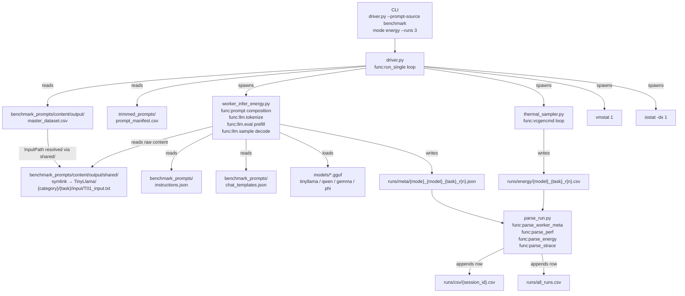
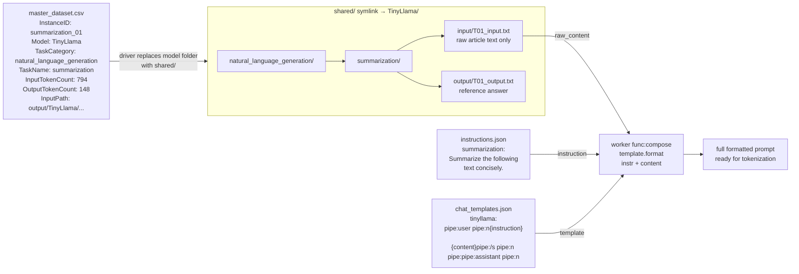
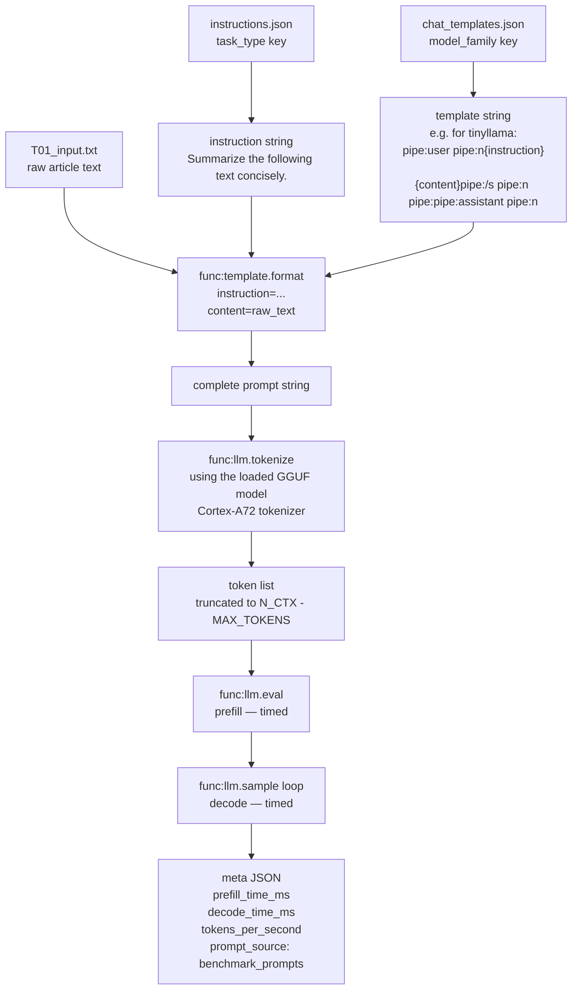
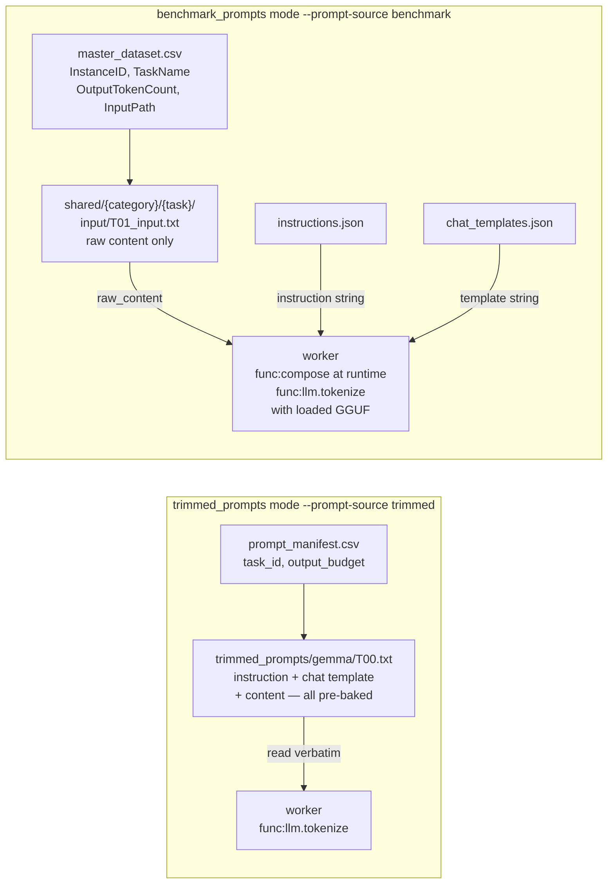
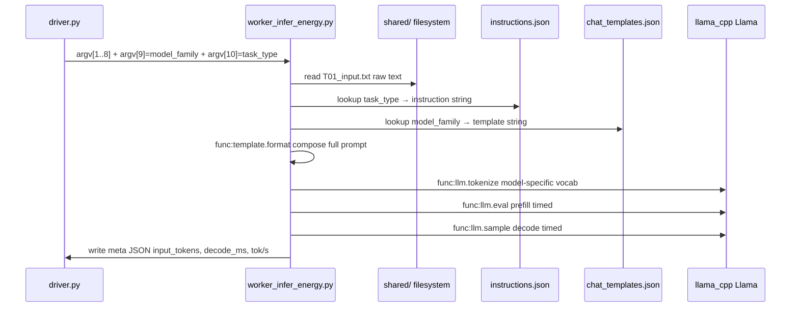

# GRIP — Changes, Architecture & Usage Guide

> **GRIP** = GGUF Runtime Inference Profiler
> Target hardware: Raspberry Pi 4 (Cortex-A72, 4 cores)
> This document describes all changes made to support `benchmark_prompts` alongside the original `trimmed_prompts`, and how to run experiments with both.

---

## Table of Contents

1. [What Changed and Why](#1-what-changed-and-why)
2. [File and Folder Map](#2-file-and-folder-map)
3. [How the Pieces Connect](#3-how-the-pieces-connect)
4. [Prompt Pipeline: Trimmed vs Benchmark](#4-prompt-pipeline-trimmed-vs-benchmark)
5. [Runtime Tokenization Flow](#5-runtime-tokenization-flow)
6. [How to Run](#6-how-to-run)
7. [Output Structure](#7-output-structure)
8. [Quick Reference](#8-quick-reference)

---

## 1. What Changed and Why

### Background

The original pipeline was built around `trimmed_prompts/` — a set of pre-formatted `.txt` files where each file already contained the task instruction and chat template baked in, one file per model per task. This worked but had two limitations:

1. **No benchmark support** — `benchmark_prompts/` stores raw content only (no instruction, no chat wrapping). The worker had no mechanism to compose a prompt at runtime.
2. **4× redundancy** — `benchmark_prompts/` had four identical copies of every raw text file, one per model folder (`Gemma/`, `Phi/`, `Qwen/`, `TinyLlama/`). Since the worker tokenizes using the loaded GGUF model anyway, the copies served no purpose.

### Changes Made

| File | What Changed |
|------|-------------|
| `benchmark_prompts/instructions.json` | **New** — maps all 25 task names to instruction strings |
| `benchmark_prompts/chat_templates.json` | **New** — maps model family to chat template format string |
| `benchmark_prompts/content/output/shared` | **New** — symlink to `TinyLlama/`; single canonical content source |
| `driver.py` | Added `--prompt-source` flag, `MODEL_FOLDER_MAP`, benchmark main loop branch, updated `build_worker_cmd` |
| `worker_infer_energy.py` | Added optional `argv[9]` / `argv[10]`, runtime prompt composition from JSON files, dynamic `prompt_source` in meta output |

---

## 2. File and Folder Map

```
driver_and_worker/
│
├── driver.py                          ← Orchestrator — runs all models × all tasks
├── worker_infer_energy.py             ← Worker — loads GGUF, tokenizes, times inference
├── parse_run.py                       ← Parser — reads perf/strace/energy outputs → CSV row
├── thermal_sampler.py                 ← Background sampler — temp/voltage every 0.5s
│
├── trimmed_prompts/                   ← Original prompt source (instruction baked in)
│   ├── prompt_manifest.csv            ← Index: model, task_id, output_budget, trim_mode, …
│   ├── gemma/
│   │   ├── T00.txt                    ← Complete formatted prompt for gemma
│   │   └── T01.txt … T36.txt
│   ├── phi/
│   ├── qwen/
│   └── tinyllama/
│
├── benchmark_prompts/                 ← New prompt source (raw content only)
│   ├── instructions.json              ← NEW: task_name → instruction string (25 tasks)
│   ├── chat_templates.json            ← NEW: model_family → template string (4 models)
│   └── content/
│       └── output/
│           ├── master_dataset.csv     ← Index: InstanceID, Model, TaskCategory, TaskName,
│           │                              InputTokenCount, OutputTokenCount, InputPath, …
│           ├── shared/  ──symlink──► TinyLlama/    ← NEW: single canonical content dir
│           ├── Gemma/   ┐
│           ├── Phi/     ├─ identical content, kept for reference (not read by driver)
│           ├── Qwen/    │
│           └── TinyLlama/
│               └── {category}/{task_name}/
│                   ├── input/
│                   │   └── T01_input.txt … T30_input.txt   ← raw text only
│                   └── output/
│                       └── T01_output.txt … T30_output.txt ← reference answers
│
└── runs/                              ← All experiment outputs (auto-created)
    ├── all_runs.csv                   ← Master CSV across all sessions
    ├── stat/                          ← perf stat output files (*_1a.txt … *_1e.txt)
    ├── energy/                        ← Thermal CSV files per run
    ├── strace/                        ← strace -c output files
    ├── record/                        ← perf record .data files
    ├── meta/                          ← Session JSON + worker meta JSON per run
    ├── proc/                          ← /proc/meminfo snapshots (before/after)
    ├── io/                            ← vmstat + iostat logs
    └── csv/                           ← Per-session CSV files
```

---

## 3. How the Pieces Connect

### Overall System Flow



---

### benchmark_prompts Internal Structure



---

### Prompt Composition Detail



---

## 4. Prompt Pipeline: Trimmed vs Benchmark



**Key difference:** In trimmed mode the file *is* the prompt. In benchmark mode the prompt is assembled by the worker at runtime from three separate sources — and the tokenization uses whichever GGUF model is currently loaded, so it is always model-correct.

---

## 5. Runtime Tokenization Flow

The `shared/` symlink stores raw text. Model-specific behavior is injected entirely at runtime:



The same raw file in `shared/` produces a different token sequence for each model because `llm.tokenize` uses that model's vocabulary. The `shared/` folder name makes it clear the content is model-agnostic raw text.

---

## 6. How to Run

### Prerequisites

```bash
# On the Raspberry Pi — from the driver_and_worker/ directory
# Models must exist at paths defined in driver.py MODELS dict
ls /home/pi/edge-llm-bench/models/
# tinyllama-1.1b-chat-v1.0.Q5_K_M.gguf
# qwen2.5-3b-instruct-q5_k_m.gguf
# gemma-2-2b-it-Q5_K_M.gguf
# phi-2.Q5_K_M.gguf
```

### trimmed_prompts (original behaviour, unchanged)

```bash
# Energy + thermal pass — 3 runs per task
nohup python3 driver.py energy --runs 3 > logs/energy.log 2>&1 &

# PMU stat pass — 5 perf sub-passes per task per run
nohup python3 driver.py stat --runs 3 > logs/stat.log 2>&1 &

# Syscall tracing
nohup python3 driver.py strace --runs 1 > logs/strace.log 2>&1 &

# Flamegraph data
nohup python3 driver.py record --runs 1 > logs/record.log 2>&1 &

# Cold-start (drops page cache before each run, needs root)
sudo python3 driver.py stat --cold > logs/cold.log 2>&1
```

### benchmark_prompts (new)

Just add `--prompt-source benchmark`. Everything else is identical:

```bash
# Energy pass with benchmark prompts
nohup python3 driver.py energy --runs 3 --prompt-source benchmark \
  > logs/bench_energy.log 2>&1 &

# PMU stat pass
nohup python3 driver.py stat --runs 3 --prompt-source benchmark \
  > logs/bench_stat.log 2>&1 &

# Strace
nohup python3 driver.py strace --runs 1 --prompt-source benchmark \
  > logs/bench_strace.log 2>&1 &

# Longer cooldown for larger benchmark tasks
nohup python3 driver.py energy --runs 3 --cool 30 --prompt-source benchmark \
  > logs/bench_energy_cool.log 2>&1 &
```

### What the driver does per task (benchmark mode)

```
For each model in {tinyllama, qwen, gemma, phi}:
  For each row in master_dataset.csv where Model == this model:
    1. Resolve InputPath → shared/{category}/{task}/input/T{n}_input.txt
    2. Spawn thermal_sampler.py + vmstat + iostat
    3. Spawn worker_infer_energy.py with:
         argv[1]  = model GGUF path
         argv[2]  = shared input file path
         argv[3]  = OutputTokenCount from CSV
         argv[4..6] = N_CTX, N_BATCH, THREADS
         argv[7]  = energy CSV path (for thermal_sampler)
         argv[8]  = meta JSON output path
         argv[9]  = model_family  e.g. "gemma"
         argv[10] = task_type     e.g. "summarization"
    4. Worker reads raw content, looks up instruction + template,
       composes full prompt, tokenizes with the loaded GGUF, runs inference
    5. Stop monitors, write meta JSON
    6. Call parse_run.py → append one row to session CSV + master CSV
    7. Sleep COOL_SECS seconds (default 10)
```

### CLI Reference

```
python3 driver.py <mode> [options]

Modes:
  energy   Clean inference + thermal sampling. Best for timing and power data.
  stat     5 sequential perf sub-passes per task (PMU event groups 1a–1e).
           No counter multiplexing. 5× slower than energy mode.
  strace   Syscall tracing with strace -c. ~5–15% overhead.
  record   perf record for flamegraph post-processing.

Options:
  --runs N          Logical runs per task (default: 1)
  --cool N          Cooldown seconds between runs (default: 10)
  --cold            Drop page cache before each run (requires root)
  --freq N          perf record sampling Hz (default: 99)
  --dwarf           Use --call-graph dwarf for perf record
  --prompt-source   trimmed (default) or benchmark
```

---

## 7. Output Structure

```
runs/
├── all_runs.csv                              ← Master — every row from every session
├── csv/
│   └── session_energy_24032026_143000.csv   ← Per-session rows
├── meta/
│   ├── session_energy_24032026_143000_session.json   ← CPU governor, throttle state, …
│   └── energy_gemma_summarization_01_r1.json         ← Per-run worker output:
│                                                          input_tokens, output_tokens
│                                                          prefill_time_ms, decode_time_ms
│                                                          tokens_per_second
│                                                          prompt_source: "benchmark_prompts"
├── energy/
│   └── gemma_summarization_01_r1.csv        ← Temperature + voltage samples (0.5s interval)
├── stat/
│   ├── gemma_summarization_01_r1_1a.txt     ← perf stat: instructions, cycles, br_mis_pred
│   ├── gemma_summarization_01_r1_1b.txt     ← perf stat: SIMD/FP events
│   ├── gemma_summarization_01_r1_1c.txt     ← perf stat: L1/L2 cache + TLB
│   ├── gemma_summarization_01_r1_1d.txt     ← perf stat: memory + bus
│   └── gemma_summarization_01_r1_1e.txt     ← perf stat: OS/software events
├── strace/
│   └── gemma_summarization_01_r1.txt        ← strace -c syscall summary
├── proc/
│   ├── *_meminfo_before.txt
│   └── *_meminfo_after.txt
└── io/
    ├── *_vmstat.txt
    ├── *_iostat.txt
    └── *_thermal_stderr.txt
```

### meta JSON fields (worker output)

| Field | Description |
|-------|-------------|
| `prompt_source` | `"benchmark_prompts"` or `"trimmed_prompts"` |
| `input_tokens` | Exact token count after truncation to `N_CTX - MAX_TOKENS` |
| `output_tokens` | Tokens generated (stops at EOG or `MAX_TOKENS`) |
| `max_tokens_budget` | `OutputTokenCount` from CSV (benchmark) or `output_budget` (trimmed) |
| `prefill_time_ms` | Time for `llm.eval(prompt_tokens)` |
| `decode_time_ms` | Time for the `llm.sample` generation loop |
| `wall_time_ms` | `prefill + decode` |
| `tokens_per_second` | `output_tokens / (decode_time_ms / 1000)` |
| `prefill_tokens_per_second` | `input_tokens / (prefill_time_ms / 1000)` |
| `time_to_first_token_ms` | Equal to `prefill_time_ms` (model already loaded) |

---

## 8. Quick Reference

### Task coverage in benchmark_prompts (25 tasks)

| Category | Tasks |
|----------|-------|
| classification | sentiment_classification, topic_classification, natural_language_inference, semantic_similarity |
| natural_language_generation | summarization, paraphrasing_rewriting, creative_writing, bullet_list_generation, question_generation, data_to_text |
| text_transformation | machine_translation, text_simplification, grammar_correction |
| question_answering | closed_book_qa, open_domain_qa, multi_hop_qa, yes_no_multiplechoice |
| reasoning | math_word_problems, commonsense_reasoning |
| information_extraction | ner |
| planning | procedural_text |
| code | code_generation, code_translation |
| evaluation | fact_checking, toxicity_detection |

### Chat templates used (from chat_templates.json)

| Model | Format | Note |
|-------|--------|------|
| gemma | `<bos><start_of_turn>user\n{instruction}\n\n{content}<end_of_turn>\n<start_of_turn>model\n` | `<bos>` required — model has `add_bos_token: true` |
| phi | `Instruct: {instruction}\n\n{content}\n\nOutput:` | Phi-2 is a base model, not instruct-tuned; no chat tokens |
| qwen | `<\|im_start\|>user\n{instruction}\n\n{content}<\|im_end\|>\n<\|im_start\|>assistant\n` | ChatML format |
| tinyllama | `<\|user\|>\n{instruction}\n\n{content}</s>\n<\|assistant\|>\n` | Zephyr template; `</s>` after user content |

### Why shared/ instead of per-model folders?

The four model folders (`Gemma/`, `Phi/`, `Qwen/`, `TinyLlama/`) in `benchmark_prompts/content/output/` are byte-for-byte identical — confirmed by `diff`. They are raw text files. The model-specific behaviour lives entirely in:

1. `chat_templates.json` — wraps the text with the correct special tokens
2. `instructions.json` — prepends the task instruction
3. `llm.tokenize()` — uses the loaded GGUF's own vocabulary

`shared/` is a symlink to `TinyLlama/`. The driver reads all prompt content through `shared/`, keeping the code model-agnostic and eliminating the 4× redundancy without touching any of the original files.
